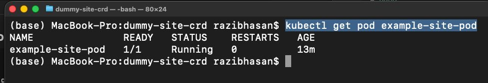
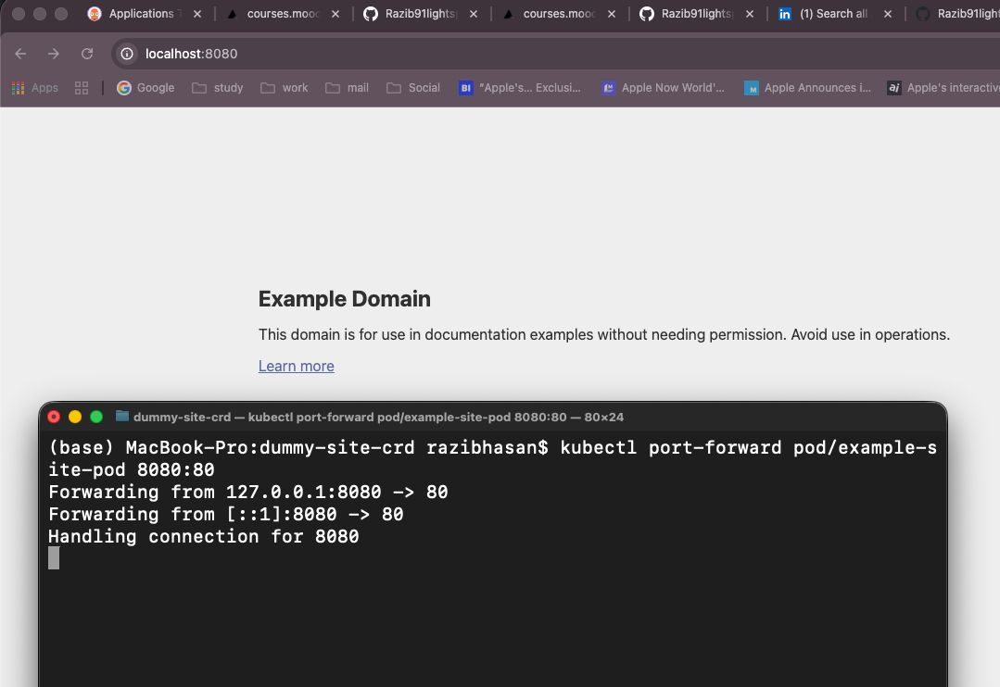

# Exercise 5.1 – DIY CRD & Controller (DummySite)

## Overview

This project implements a custom Kubernetes resource **DummySite** and a controller that automatically creates an HTML mirror of any given website URL.

When a `DummySite` object is created, the controller:

1. Watches the Kubernetes API for new DummySite resources
2. Downloads the HTML from `website_url`
3. Stores the HTML inside a ConfigMap
4. Creates an nginx Pod
5. Mounts the ConfigMap as `/usr/share/nginx/html/index.html`
6. Serves the copied page

This follows the standard **CRD + Controller (Operator pattern)** inside Kubernetes.

---

## Architecture

```
DummySite (CRD)
      ↓
Controller (watch)
      ↓
Fetch website HTML
      ↓
Create ConfigMap
      ↓
Create nginx Pod
      ↓
Serve copied page
```

---

## Project Structure

```
dummy-site-crd/
├─ controller/
│  ├─ Dockerfile
│  ├─ index.js
│  └─ package.json
│
├─ manifests/
│  ├─ crd.yaml
│  ├─ serviceaccount.yaml
│  ├─ clusterrole.yaml
│  ├─ clusterrolebinding.yaml
│  ├─ deployment.yaml
│  └─ dummysite.yaml
│
└─ images/
   └─ ex5.2.jpeg
```

---

## Custom Resource Definition

```yaml
apiVersion: stable.dwk/v1
kind: DummySite
metadata:
  name: example-site
spec:
  website_url: "https://example.com"
```

---

## Build Controller Image

```bash
cd controller

docker buildx build \
  --platform linux/amd64 \
  -t razibhasan2/dummy-controller:v1 \
  --push .
```

---

## Deploy Resources

Apply in this order:

```bash
kubectl apply -f manifests/crd.yaml
kubectl apply -f manifests/serviceaccount.yaml
kubectl apply -f manifests/clusterrole.yaml
kubectl apply -f manifests/clusterrolebinding.yaml
kubectl apply -f manifests/deployment.yaml
kubectl apply -f manifests/dummysite.yaml
```

---

## Verify

Check resources:

```bash
kubectl get pod example-site-pod
```

Expected:



---

## Access Website

```bash
kubectl port-forward pod/example-site-pod 8080:80
```

Open:

```
http://localhost:8080
```

---

## Screenshot Proof

The screenshot below shows:

- Controller running
- Port forwarding active
- Website successfully copied and served locally



---

## Notes

- Only raw HTML is copied (CSS/JS may be missing or broken)
- This is acceptable according to the assignment instructions
- The controller demonstrates:
  - CRD creation
  - Kubernetes API watch
  - ConfigMap generation
  - Pod creation
  - Automated reconciliation

---

## Result

- DummySite resource created
- Controller reacts automatically
- Website HTML mirrored
- Page accessible via port-forward

Exercise requirements successfully completed.

# End
